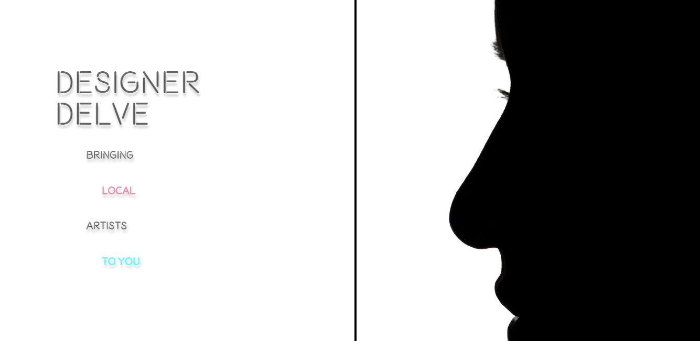
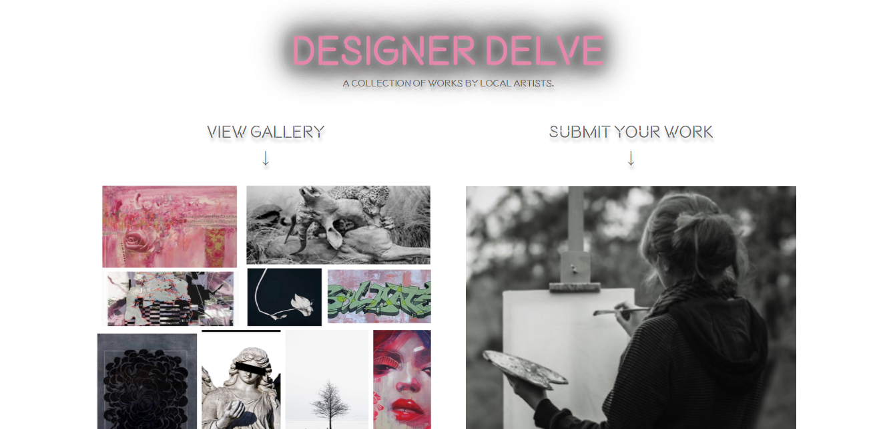
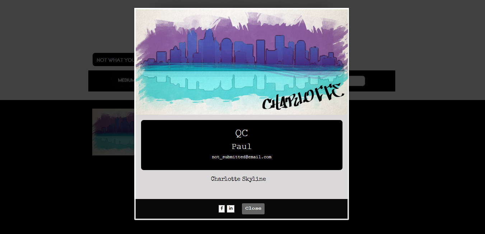
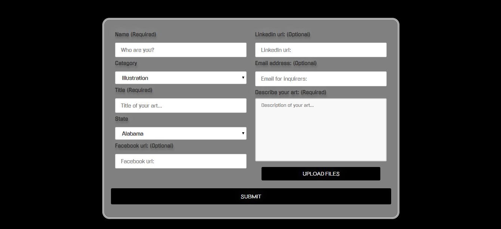

# [Designer Delve](https://whispering-escarpment-60858.herokuapp.com/)

This application welcomes users with an initial landing page, then redirects to the home page.

On the home page there are two options: 

  Click "View Gallery" - 
    Search by medium on the left, and state on the right, at the top. If art has been submitted that meet those criteria the images will load underneath. The images are modal dialog buttons that will display a modal with the full-size image, a description, the artist's name, the title of the art, the artist's email address, and a link to their Facebook and LinkedIn for means of contact. 

  
  
  Click "Submit Your Work" -
    If you are an artist looking to submit your own artwork, you are redirected to a form with 6 required fields, your name, the title of your submission, a description of your submission, the category(medium) of your art, your state, and your uploaded image. There are additional optional fields such as email, LinkedIn, and Facebook to allow users looking through the gallery means to contact you should they want to connect.

  
    
The button at the top, ("Not what you're looking for?"), will open the side navbar for site navigation.
  

MySQL was used for the database and a cloudinary widget was used for image uploads and image url creation for the database.
Other tech used - handlebars.js, jquery, GreenSock(GSAP), node and express.

Some additional responsiveness checks and cross-brwoser compatability can be implemented to ensure a more versatile experience.
